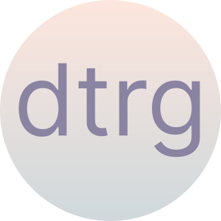

# dt-report-generator (dtrg) 

> **Note:** version 2.0.0 brings several breaking changes (TLS verification on by default, CSRF enforced on form endpoints, Docker runs as non-root, new env vars). See [CHANGELOG.md](CHANGELOG.md) for the full list before upgrading.
## Main information
Tool for create reports from [Dependency Track](https://dependencytrack.org/) in Word (.docx) and Excel (.xlsx) formats.\
More information about tool and how to use it can be found in the articles on habr [1](https://habr.com/ru/articles/860536/), [2](https://habr.com/ru/articles/900276/) (rus).
## Getting started
### Installation and start
№1. Python
```
git clone <this repo>
pip install --upgrade pip
pip install -r requirements.txt
python ./app.py
```
№2. Docker
```
docker pull ghcr.io/denimoll/dt-report-generator:latest
docker run --name dtrg -d -p 5000:5000 ghcr.io/denimoll/dt-report-generator
```
### Usage
1. Open in browser [localhost:5000](http://localhost:5000)
2. Fill out the form:
    - URL - DT address (format "protocol"://"domain"). For example, [https://dependencytrack.org](https://dependencytrack.org). The path to the API is automatically substituted - */api/v1/*
    - Token - API key ([how to get](https://docs.dependencytrack.org/integrations/rest-api/))
    - Project - project ID (Object Identifier parameter in Project Details or identifier in the URL after ".../projects/")
3. Click "Get report"
4. Wait
## CI usage
For pipelines a JSON API is exposed alongside the form. It returns the same ZIP, but does not need a browser session and is suitable for `curl` from a build job.

Generate a report:
```
curl -fSL -o report.zip \
    -H "X-DTRG-Key: $DTRG_API_KEY" \
    -H "Content-Type: application/json" \
    -d '{"project":"<uuid>"}' \
    http://dtrg.internal:5000/api/v1/reports/get_report
```
List projects to look up a UUID:
```
curl -fsSL \
    -H "X-DTRG-Key: $DTRG_API_KEY" \
    -H "Content-Type: application/json" \
    -d '{}' \
    http://dtrg.internal:5000/api/v1/projects | jq '.[] | {name, version, uuid}'
```
Need to filter or paginate? Pass `searchText`, `pageSize` and `pageNumber` in the JSON body. Total matches come back in the `X-Total-Count` response header. Without those fields the endpoint returns the full list as before.

Diff between two versions of the same project:
```
curl -fSL -o diff.zip \
    -H "X-DTRG-Key: $DTRG_API_KEY" \
    -H "Content-Type: application/json" \
    -d '{"projectA":"<old-uuid>","projectB":"<new-uuid>"}' \
    http://dtrg.internal:5000/api/v1/reports/diff
```
The ZIP contains `result.xlsx` (sheets: General information, Added, Removed, Common) and `summary.json` (`kind: "diff"`). Common entries surface both component versions and both VEX states so a CVE that travelled with a library upgrade is visible.
Notes:
- `url` and `token` can be omitted from the request body when `DT_URL` and `DT_TOKEN` are set in the dtrg environment.
- The endpoints are open by default. When the service is reachable beyond a trusted network, set `DTRG_API_KEY` so requests must present the same key in the `X-DTRG-Key` (or `Authorization: Bearer ...`) header.
- Errors come back as `{"error": "..."}` with a non-200 status, never as a redirect.
- These endpoints are deliberately CSRF-exempt (CI tooling has no session). The form endpoints (`/reports/get_report`, `/projects/get_all`) keep CSRF protection on; rely on `DTRG_API_KEY` and network controls for `/api/v1/*`.
- The full OpenAPI spec is served at [`/apispec.json`](http://localhost:5000/apispec.json) and the Swagger UI at [`/apidocs/`](http://localhost:5000/apidocs/), so you can explore request shapes and try calls from the browser.

## Advanced usage
You can set environment variable. A couple of examples: \
\
№1. dtrg as a service
```
export DT_URL="http://evil.com"
export DT_TOKEN="some_special_token"
```
№2. Vulnerability prioritization or enrichment
You must beside deploy [CVE-PaaS](https://github.com/denimoll/CVE-PaaS) tool. dtrg batches all CVE ids of a project into a single `POST /v1/cve` call (chunks of 50 transparently), so even projects with hundreds of CVEs add only a few CVE-PaaS round-trips. The enrichment surfaces CVSS, EPSS, KEV / PoC / Nuclei flags - directly in the `Additional info` column of the Excel report and as fields in `summary.json`. If CVE-PaaS is unreachable or returns an error, dtrg logs a warning and continues to render the report **without** enrichment instead of failing the run.
```
export CVEPAAS_URL="http://evil.com"
# optional: when CVE-PaaS is started with CVE_PAAS_API_KEY set
export DTRG_CVEPAAS_KEY="cvepaas-secret"
```
№3. Custom port
```
export DTRG_PORT=5252
```
When use docker run container with this command:
```
docker run --name dtrg -d -p $DTRG_PORT:5000 ghcr.io/denimoll/dt-report-generator
```
№4. Show VEX-suppressed findings
By default dtrg honours VEX: a finding marked in DT as `resolved`, `resolved_with_pedigree`, `false_positive` or `not_affected` is dropped from the report so it matches what the DT UI shows. Set the variable below to keep them in the output and see their analysis state in the `All issues` sheet.
```
export DTRG_INCLUDE_SUPPRESSED=true
```
№5. Restrict which DT instances dtrg will fetch
When dtrg accepts the DT URL from the form / API, set an allowlist so it cannot be pointed at arbitrary internal hosts (SSRF mitigation). Empty (default) keeps the previous behaviour. Patterns are comma-separated; `*.example.com` matches subdomains.
```
export DTRG_ALLOWED_HOSTS="dt.example.com,*.dt.example.com"
```

All environment variables:
* DT_URL - DT address
* DT_TOKEN - DT API key
* DTRG_PORT - dtrg port
* DTRG_HOST - bind address (default: 0.0.0.0)
* DTRG_DEBUG - dtrg (Flask) debug mode. Refuses to start when combined with a non-loopback DTRG_HOST unless DTRG_DEBUG_ALLOW_REMOTE=true is set, because the Werkzeug debugger can be used for remote code execution.
* DTRG_DEBUG_ALLOW_REMOTE - explicit override that allows DTRG_DEBUG=true together with a non-loopback DTRG_HOST. Use only in trusted networks.
* DTRG_VERIFY_TLS - verify TLS certificate of DT and CVE-PaaS (default: true; set to false only for self-signed test instances)
* DTRG_HTTP_TIMEOUT - timeout in seconds for outbound HTTP calls to DT and CVE-PaaS (default: 120)
* DTRG_SECRET_KEY - Flask secret key used to sign session cookies and CSRF tokens for the form endpoints (`/`, `/reports/get_report`, `/projects/get_all`). Set a stable value when running multiple workers or behind a reverse proxy so tokens stay valid across restarts. If unset, a random key is generated on each start.
* DTRG_API_KEY - shared secret required on the /api/v1/* endpoints. When unset (default) those endpoints are open and only network controls protect them; when set, callers must present the same value in an `X-DTRG-Key` or `Authorization: Bearer ...` header.
* DTRG_API_RATE_LIMIT - per-IP rate limit applied to /api/v1/* (default `60/minute`). Empty disables enforcement. Format follows [Flask-Limiter notation](https://flask-limiter.readthedocs.io/en/stable/configuration.html#rate-limit-string-notation): e.g. `30/minute`, `1000/hour`, `5/second`.
* DTRG_ALLOWED_HOSTS - comma-separated SSRF allowlist for the DT URL. When set, only listed hosts are accepted from the form / API (`*.example.com` matches subdomains). Default empty = no restriction (suitable for on-prem). Use this when running dtrg as a public service.
* DTRG_CVEPAAS_KEY - optional CVE-PaaS API key. When set, dtrg adds an `X-API-Key` header to every CVE-PaaS request. Match the value of `CVE_PAAS_API_KEY` configured on the CVE-PaaS side.
* DTRG_INCLUDE_SUPPRESSED - when `true`, vulnerabilities that DT considers suppressed via VEX (state `resolved` / `resolved_with_pedigree` / `false_positive` / `not_affected`) are still rendered in the report with their analysis state in the `All issues` sheet. Default `false`, which matches the DT UI.
* DTRG_GRAPH_DEPTH - max depth of the dependency graph traversal. Direct dependencies are level 1, their children level 2, etc. The level of each component is shown in column G of the `Vulnerable dependencies` sheet; components beyond the depth limit show an empty cell. Default 3.
* DTRG_PROJECTS_PAGE_SIZE - page size for the form's project dropdown. Projects are loaded lazily as the user scrolls or types into the search box, so this controls how many DT projects are fetched per round-trip. Default 50. Does not affect `/api/v1/projects` (which still returns the full list by default).
* CVEPAAS_URL - [CVE-PaaS](https://github.com/denimoll/CVE-PaaS) address
## Development
Tests live under `tests/` and run with pytest:
```
pip install -r requirements-dev.txt
pytest -q
```
The same suite runs on every push/PR via `.github/workflows/tests.yml`.
## Roadmap
Planned functionality:
- [x] *Project search*. Simplify the search for projects via the provided link and token.
- [x] *Dependency tree*. Export the tree with vulnerable components marked.
- [x] *Release policy*. Create release rules and publish Docker images.
- [x] *Reports*. Add a text to docx when 0 vulns.
- [x] *Dashboards with overview information*. Visualize data in the form of various graphs for visual analysis.
- [x] *Icon*. Create an icon for tool and add a favicon.
- [x] *Secure use as a service*. Add the ability to define trusted addresses (SSRF exclusion) or disable URL and token selection by setting default values.
- [x] *Vulnerability prioritization*. Implement logic that will help assess which vulnerabilities require priority fixing.
- [x] *Docs*. Add a documentation or just more info in readme.md for advansed settings (like custom port, use specific version and etc.)
- [x] *VEX support*. Honour CycloneDX analysis state from DT so suppressed findings are dropped (or surfaced via DTRG_INCLUDE_SUPPRESSED) in the report.
- [x] *Tests*. Smoke/unit tests for validators, severity merge, graph traversal, VEX filter and the API auth paths, run on every PR.
- [x] *Optimization*. Project dropdown is lazy-loaded via select2 ajax with debounced search. Page size controlled by `DTRG_PROJECTS_PAGE_SIZE`.
- [x] *Graph*. Configurable traversal depth via `DTRG_GRAPH_DEPTH`; per-component level surfaced in the report.
- [x] *Specification*. OpenAPI 2.0 spec served at `/apispec.json`; Swagger UI at `/apidocs/`.

- [x] *Quick wins (2.1.0)*. `summary.json` bundled in the report ZIP; multi-arch Docker (`linux/amd64`+`linux/arm64`); CI matrix Python 3.11/3.12/3.13; per-request env in `GetReportForm`.

- [x] *Diff between project versions (2.1.0)*. New endpoints `/reports/diff` and `/api/v1/reports/diff`; checkbox on the form reveals the second project select. ZIP carries `result.xlsx` + `summary.json` describing what was added, removed or stayed common.

### CVE-PaaS collaboration
Caching is intentionally out of scope here — CVE-PaaS owns it on its side.
- [x] *Graceful degradation*. CVE-PaaS errors / timeouts no longer abort the report; dtrg logs a warning and continues without enrichment for that batch.
- [x] *Batch endpoint*. dtrg now calls `POST /v1/cve` once per project (in chunks of 50 ids) instead of per-vulnerability GETs.
- [x] *Wider enrichment*. CVSS, EPSS and the KEV / PoC / Nuclei flags from CVE-PaaS land in the `Additional info` column and in `summary.json`.
- [x] *CVE-PaaS auth*. `DTRG_CVEPAAS_KEY` env attaches `X-API-Key` to every CVE-PaaS call.

### On demand
Pulled out of the active list — pick up only when there is a concrete trigger.
- [x] *Rate limiting* on `/api/v1/*`. Per-IP cap via Flask-Limiter, controlled by `DTRG_API_RATE_LIMIT` (default `60/minute`).
- [x] *SSRF allowlist* for the user-supplied DT URL. `DTRG_ALLOWED_HOSTS` (comma-separated, supports `*.subdomain` wildcards). Empty by default - on-prem keeps the old "any host" behaviour.
